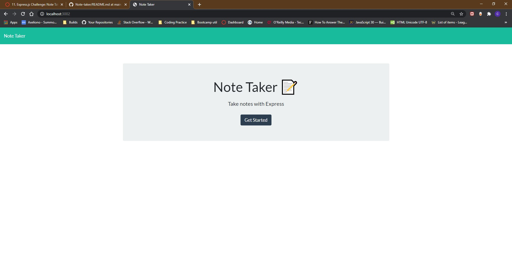
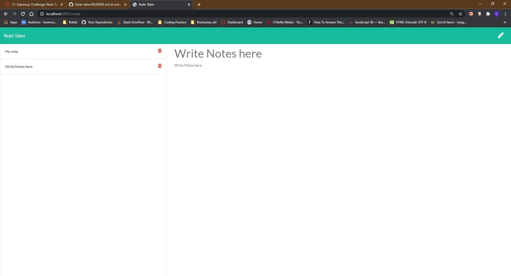

# Note-Taker

## Table of Contents:

-[Description](#description)
-[Installation Instructions](#installation-instructions)
-[Test](#test)
-[Images](#images)
-[License](#license)
-[Contributors](#contributors)
-[Questions](#questions)

## Description

A node.js application that allows the user to write a series of notes that can be saved and deleted

## Installation Instructions

Clone the repository for this project. Install npm packages using (npm install) to run the application. Open the command line terminal for the application.

## Test

type {npm start} into the terminal to begin

## Images/Video

Image of completed HTML

## License

## Contributors

Chandler Green

## Questions

Here are my email address and Github username if there are any questions

email: chandlergreen1997@gmail.com
Github: (https://github.com/axeliono)
